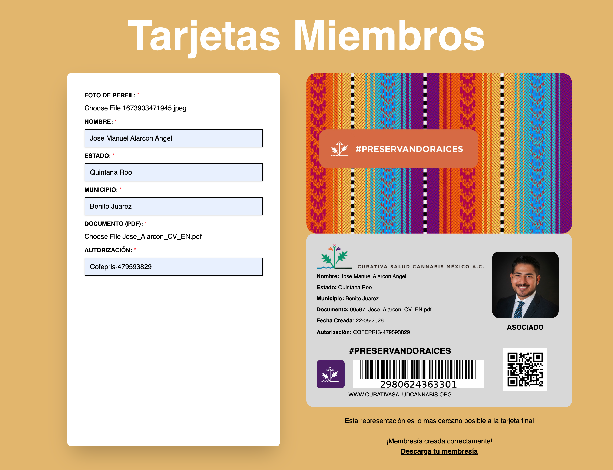

# Tarjetas Miembros — curativasaludcannabis.org

A digital membership card generator I built for Curativa Salud, a Mexican civil association. The tool lets staff create printable ID cards for their members from a form, with a live preview that matches exactly how the final card will look.

**Live site:** [tarjetasmiembros.curativasaludcannabis.org](https://tarjetasmiembros.curativasaludcannabis.org)



---

## What it does

The page has two sides: a form on the left where you fill in the member's data (name, state, municipality, photo, documents, authorization), and a live preview on the right that updates as you type.

The preview shows both sides of the credential:

- **Front** — branded design with the association's identity (textile pattern, hashtag, logo).
- **Back** — the actual ID layout: member photo, personal data, creation date, a QR code linking to their profile, a barcode with the unique member ID, and the association's branding.

When everything looks right, the "GENERAR PDF" button captures the credential as a high-quality PDF ready to print.

## Tech stack

- **Next.js 15** + **React 19** (App Router)
- **TypeScript**
- **Tailwind CSS v4**
- **Prisma** as ORM
- **Supabase** for the database and file storage
- **html2canvas** for the HTML → PDF conversion
- **react-hot-toast** for inline feedback
- Deployed on **Vercel**

## What I focused on

- **Live preview that actually matches the printed result.** This was the trickiest part. Generating a PDF that looks identical to what the user sees on screen — including custom fonts, the textile background, the QR and barcode positioning — required tuning the html2canvas options and the print sizing carefully.

- **QR + barcode generation.** Each member gets a unique ID that's encoded both as a barcode (for quick scanning) and a QR code (linking to their profile). Both are generated on the fly from the member's data.

- **File handling.** Profile pictures and supporting PDFs are uploaded by the staff and stored on Supabase. The tricky part was making sure images come back at the right resolution for printing without blowing up the bundle.

- **Form UX.** Real-time validation, optional vs required fields, dropdowns for Mexican states and municipalities, and toast notifications for the upload + generation steps. The goal was that non-technical staff could use it without training.

- **Visual fidelity.** The credential design has a specific look (custom typography, branded patterns, layered backgrounds) that had to survive the PDF conversion intact. A lot of the work was CSS-level tuning to make sure html2canvas captured everything correctly.

## Screenshots

| Form + live preview | Generated PDF |
|---|---|
|  |  |

## Running it locally

```bash
git clone https://github.com/polilla2802/nextjs-curativasalud
cd nextjs-curativasalud
npm install
npm run dev
```

Then open `http://localhost:3000`.

You'll need a `.env.local` with your own Supabase credentials and Prisma connection string. There's an example in `.env.example`.

If you want to run the database side, you also need to run the Prisma migrations:

```bash
npx prisma generate
npx prisma migrate dev
```

## Notes

This is a freelance project I built for Curativa Salud, a Mexican civil association. The code is open here, but the brand assets and the member data belong to them. If you want to see the actual flow, the live site at [tarjetasmiembros.curativasaludcannabis.org](https://tarjetasmiembros.curativasaludcannabis.org) is the easiest way.
